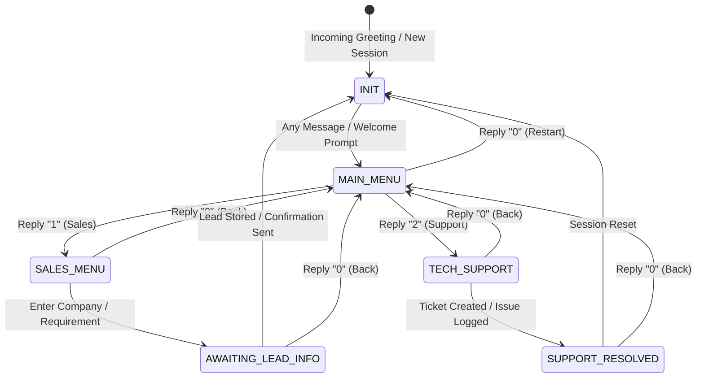
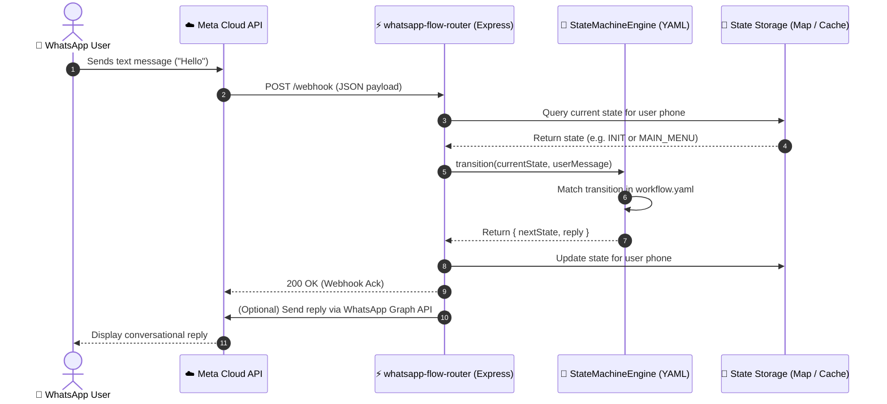

# 💬 whatsapp-flow-router

> **Topics:** `whatsapp-cloud-api` `chatbot` `state-machine` `conversational-ai` `lead-qualification` `meta-api`


[](https://github.com/MobileConduit/whatsapp-flow-router/releases/tag/v1.0.0)
[](https://github.com/MobileConduit/whatsapp-flow-router/actions)
[](LICENSE)
[](https://nodejs.org)
[](https://developers.facebook.com)

A high-performance, deterministic state-machine conversational router for the **WhatsApp Cloud API**. Enables enterprise lead qualification, dynamic menu trees, multi-stage routing, and automated support workflows without proprietary vendor lock-in or costly subscription bot builders.

---

## 🚀 Key Features

- **Declarative YAML Workflow Engine**: Define conversational states, replies, and routing transitions cleanly in `workflow.yaml`.
- **Deterministic State Machine**: Robust session state tracking per user phone number with graceful fallback handling.
- **Zero-Dependency QR Code SVG Generator**: Instantly generate vector QR codes for WhatsApp *Click-to-Chat* (`https://wa.me/...`) links.
- **Meta Webhook Verification & Processing**: Fully compatible with Meta's challenge/response handshake and incoming message webhook payloads.
- **Automated Test Suite**: Native unit & integration tests using Node.js test runner (`node:test`).
- **Production-Ready CI/CD**: GitHub Actions workflow testing across Node.js 18.x, 20.x, and 22.x.

---

## 🔄 Architecture & Workflows

### 1. Conversational State Machine Diagram



### 2. End-to-End Sequence Diagram



---

## 🛠️ Getting Started

### Prerequisites
- **Node.js**: v18.0.0 or higher
- **npm**: v9.0.0 or higher

### Installation

```bash
# Clone the repository
git clone https://github.com/MobileConduit/whatsapp-flow-router.git
cd whatsapp-flow-router

# Install dependencies
npm install

# Configure environment variables
cp .env.example .env
```

### Configuration (`.env.example`)

```env
PORT=8000
VERIFY_TOKEN=MY_VERIFY_TOKEN
WHATSAPP_TOKEN=your_meta_access_token_here
PHONE_NUMBER_ID=your_phone_number_id_here
WORKFLOW_FILE=workflow.yaml
WHATSAPP_BUSINESS_PHONE=+963934005922
```

### Running the Server

```bash
npm start
```

### Generating WhatsApp Onboarding QR Codes

Generate an SVG QR code pointing directly to your WhatsApp business chat with a pre-filled greeting:

```bash
# CLI execution
node qr-generator.js --phone +963934005922 --text "Hello Shadi, I'm inquiring about enterprise architecture." --output onboarding_qr.svg

# Or fetch dynamically from the running server:
# http://localhost:8000/qr.svg?phone=+963934005922&message=Hello
```

### Running Automated Tests

```bash
npm test
```

---

## 👤 Author & Maintainer

**Eng. MHD. Shadi AL-Hasan**  
- **Role:** Executive CTO & Enterprise Solutions Architect  
- **Email:** [mhd.shadi.alhasan@gmail.com](mailto:mhd.shadi.alhasan@gmail.com)  
- **Phone / WhatsApp:** [+963934005922](tel:+963934005922)  
- **Location:** Damascus, Syria  
- **GitHub:** [MobileConduit](https://github.com/MobileConduit)  

---

## 📄 License

This project is licensed under the MIT License - see the [LICENSE](LICENSE) file for details.  
Copyright (c) 2026 **MHD. Shadi AL-Hasan**. All rights reserved.